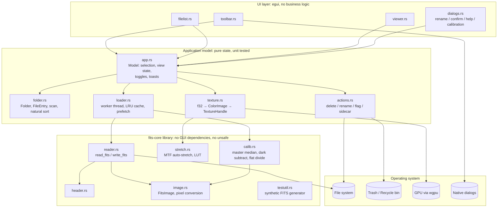
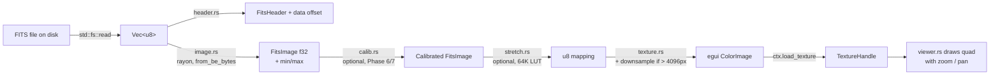
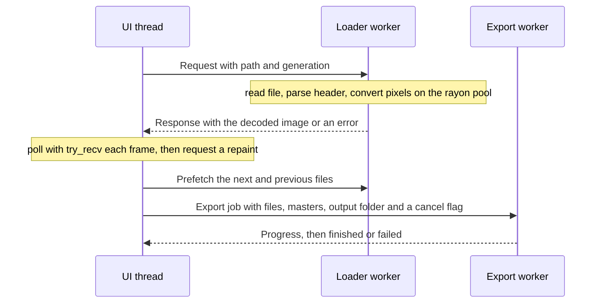

# fitsview — Phased Build Plan

This is the execution plan `fitsview` was built from, kept as the record of how
and why. It is self-contained: a developer can pick it up and continue phase by
phase without other context. Each phase ends with a checklist of acceptance
criteria, and what the phase actually produced, including what went wrong, is
written up beneath it.

For what the application does and how to build it, see
[README.md](README.md).

---

## 0. Product Summary

**Status:** All phases complete. Two gaps remain that need a human rather than
more code: the application has never been tried against real capture files, and
the manual checklist has never been run on Linux or Windows. See section 10.

| Phase | State |
|-------|-------|
| 0 — Bootstrap | Done |
| 1 — FITS reader | Done |
| 2 — Minimal viewer | Done |
| 3 — Folder browsing | Done |
| 4 — Delete, rename, flag | Done |
| 5 — Stretch | Done |
| 6 — Dark calibration | Done |
| 7 — Flat calibration | Done |
| 8 — Packaging | Done |
| 9 — Debayering | Done |

Keep this table current. Phase 0 is project bootstrap; phases 1 through 9
deliver the features below.

| # | Requirement | Phase |
|---|-------------|-------|
| a | Open FITS files quickly. Performance is the top priority. | 1, 2 |
| b | Open a folder of FITS files; ignore non-FITS files. | 3 |
| c1 | Delete files with a toggle button **and** a keyboard shortcut. | 4 |
| c2 | Rename files quickly. | 4 |
| d | Flag images to "keep". Flagged files need extra confirmation before deletion. | 4 |
| e | Button to apply a standard astro stretch to all viewed images; can be turned off. | 5 |
| f | Dark-frame calibration applied to all files in the folder. | 6 |
| g | Flat-frame calibration applied to all files in the folder. | 7 |
| h | Show one-shot colour frames in colour. | 9 |

---

## 1. Rules for the Builder (read before writing any code)

These rules apply to **every** phase. They override anything else in this document.

### 1.1 No `unsafe`

- Put `#![forbid(unsafe_code)]` at the top of `lib.rs` and `main.rs` in **both** crates. The compiler will then refuse any `unsafe` block.
- Do **not** use `memmap2`, raw pointer casts, `transmute`, `from_raw_parts`, or `bytemuck::cast_slice` in our code. Use the safe patterns in section 5.3 instead. They are fast enough.
- Dependencies may contain their own audited `unsafe` (e.g. `wgpu`, `rayon`). That is acceptable. Prefer a crate that declares `#![forbid(unsafe_code)]` when two crates do the same job.
- The `forbid` attribute is the real guarantee; a CI step also greps the source for the word `unsafe`. `cargo geiger` gives a dependency-tree view and is nice to have, but it is unmaintained and may fail to build. Do not block a phase on it.
- If you believe a task is **impossible or unreasonably slow** without `unsafe`, **stop and ask the maintainer** (see 1.2). Include: what you tried, a benchmark number for the safe version, and the expected gain. Do not write the `unsafe` code before asking.

### 1.2 Always ask before …

Stop and ask the maintainer (do not guess, do not proceed) before any of the following:

| Situation | What to say when asking |
|-----------|-------------------------|
| Using `unsafe` anywhere | Why, safe alternative tried, measured numbers. |
| Adding a crate that is not in the library table (section 3) | Crate name, version, what it replaces, its `unsafe` status, download count. |
| Changing the GUI framework, FITS reader strategy, or repo layout | What and why. |
| Hard-deleting, overwriting, or moving any of the user's image files outside the documented behaviour (trash-only deletes, `_cal.fits` exports) | Exactly which files. |
| Changing the sidecar `.fitsview.json` format after Phase 4 ships | Old and new schema, migration. |
| Skipping or weakening a test, or marking a test `#[ignore]` | Which test and why. |
| Deviating from a phase's acceptance criteria | Which criterion and why. |

Format the question as a short list: **what you want to do, why, the alternatives, your recommendation.** Then wait.

### 1.3 Always write tests

- **Every** new public function in `fits-core` gets at least one unit test in the same file (`#[cfg(test)] mod tests`).
- **Every** action in `actions.rs` (delete, rename, flag, sidecar read/write) gets an integration test using a `tempfile::TempDir`.
- Every phase's acceptance checklist is turned into tests where a test is possible. If a criterion can only be verified by hand (e.g. "dialog appears"), write a manual test note in `docs/manual-tests.md` and tick it off.
- Bug fixes come with a regression test that fails before the fix and passes after.
- Keep the GUI thin. All state transitions live in plain structs (`app::Model`, `folder::Folder`, `loader::Cache`) that can be tested **without** creating a window. Rendering code only reads that state and forwards input events to it.
- Tests must be deterministic and must not depend on files outside the repo. Generate FITS data with the synthetic generator in `fits-core/src/testutil.rs` (see 5.4).
- `cargo test --workspace` must be green on Linux, macOS, and Windows before a phase is considered done.
- Use `cargo clippy --workspace --all-targets -- -D warnings` and `cargo fmt --check` as part of "tests pass".

### 1.4 Be thorough

- Read the whole phase before starting it. Read the FITS primer (section 4) before Phase 1.
- Handle every error path with a typed error; never `unwrap()`/`expect()` on data that came from a file, a dialog, or the user.
- Log timing for load, convert, stretch, texture upload with `log::debug!` so performance regressions are visible.
- When a phase is done, write a short summary: what was built, what tests exist, measured timings, and open questions.
- One commit (or one pull request) per phase, with the phase number in the subject, e.g. `Phase 2: minimal viewer with zoom and pan`. Commit messages describe the change and nothing else: no tool, generator, or authorship footers.

---

## 2. Architecture

### 2.1 Layer diagram



### 2.2 Display pipeline (what happens per image)



Caches sit at three points, all bounded LRU keyed by path:
`raw FitsImage` (after I), `calibrated FitsImage` (after C, only when calibration is on), and `TextureHandle` (after T, keyed by path + stretch/calibration settings hash).

### 2.3 Threads and channels



Rules:
- The UI thread never performs file I/O or pixel math larger than a single texture upload.
- Exactly one loader worker. Requests carry a `generation` counter; responses with a stale generation are dropped.
- `rayon`'s global pool is used inside the workers for pixel loops. The UI thread does not call into `rayon`.
- All shared images are `Arc<FitsImage>` (immutable after load). No `Mutex` around pixel data.

### 2.4 Text diagram (for tools that cannot render Mermaid)

```
┌───────────────────────────────────────────────────────────────────┐
│  fitsview (binary)                                                │
│                                                                   │
│  ┌──────────┐ ┌──────────┐ ┌──────────┐ ┌──────────┐             │
│  │ toolbar  │ │ filelist │ │  viewer  │ │ dialogs  │  UI (egui)   │
│  └────┬─────┘ └────┬─────┘ └────┬─────┘ └────┬─────┘             │
│       └────────────┴─────┬──────┴────────────┘                   │
│                          ▼                                        │
│  ┌──────────────────────────────────────────────────────────┐    │
│  │ app.rs  Model (selection, toggles, view state, toasts)   │    │
│  └───┬───────────────┬───────────────┬───────────────┬──────┘    │
│      ▼               ▼               ▼               ▼           │
│  folder.rs       actions.rs      loader.rs       texture.rs      │
│  scan, sort,     delete→trash    worker thread   f32→RGBA        │
│  sidecar         rename, flag    LRU cache       downsample      │
│                                  prefetch        LUT stretch     │
└──────┬───────────────┬───────────────┬───────────────┬──────────┘
       │               │               │               │
       ▼               ▼               ▼               ▼
┌───────────────────────────────────────────────────────────────────┐
│  fits-core (library, no GUI, forbid(unsafe_code))                 │
│  header.rs  reader.rs  image.rs  stretch.rs  calib.rs  testutil   │
└──────┬────────────────────────────────────────────────────────────┘
       ▼
  File system / Trash / GPU (wgpu) / native dialogs (rfd)
```

---

## 3. Suggested Libraries

Do not add crates outside this table without asking (rule 1.2).

**On versions:** these are the versions actually in use as of Phase 2. `egui`
and `eframe` move fast and their `0.x` releases contain breaking changes, so keep
the pair on the same version as each other, and expect to adjust code when
upgrading. `Cargo.lock` is committed.

Cargo's resolver honours the workspace `rust-version`, so a too-low value makes
it silently pick old releases rather than reporting a conflict. Raise
`rust-version` to match, do not work around it.

### 3.1 Runtime dependencies

| Crate | Version | Used in | Purpose | `unsafe` notes | Alternative considered |
|-------|---------|---------|---------|----------------|------------------------|
| `eframe` | 0.35 | fitsview | Window, event loop, persistence (`Storage`), wgpu/glow backend. | Contains unsafe internally (GPU/OS bindings). Unavoidable for any GUI. | `iced` (less mature image viewer story), `tauri` (needs webview + JS), `slint` (licence). |
| `egui` | 0.35 | fitsview | Immediate-mode widgets, `ColorImage`, `TextureHandle`. | Same as above. | — |
| `rayon` | 1.10 | both | Data-parallel pixel loops, parallel reduce for min/max. | Audited unsafe internally; API is safe. | `std::thread::scope` (more code, same result). |
| `rfd` | 0.17 | fitsview | Native open-file / open-folder / message dialogs on all three OSes. | Wraps OS APIs. | `native-dialog` (fewer features). |
| `trash` | 5 | fitsview | Move files to OS trash / recycle bin; restore where supported. | Wraps OS APIs. | `std::fs::remove_file` — rejected: permanent deletion. |
| `serde` + `serde_json` | 1 | fitsview | Read/write `.fitsview.json` sidecar (flags, calibration paths). | `forbid(unsafe_code)` in serde_json. | Hand-rolled JSON — rejected. |
| `natord` | 1.0 | fitsview | Natural sort (`light_2` before `light_10`). Tiny, no deps. | Pure safe Rust. | Hand-written comparator (fine too). |
| `thiserror` | 2 | fits-core | Typed error enums. | Proc-macro, safe. | — |
| `anyhow` | 1 | fitsview | Error propagation in the app. | Safe. | — |
| `log` + `env_logger` | 0.4 / 0.11 | both | Logging with timing info. | Safe. | `tracing` (heavier than needed). |

**Not used, on purpose:**
- `memmap2` — requires `unsafe`. `std::fs::read` into a `Vec<u8>` is used instead; see 5.3 for why this is fast enough.
- `fitsio` — links C `cfitsio`; painful on Windows; unsafe FFI.
- `fitrs` / `fits-rs` — unmaintained, slower, incomplete BITPIX support.
- `bytemuck` — its casts are safe at the API level but are exactly the pattern we want to avoid reasoning about; `from_be_bytes` on chunks is clearer and equally fast.
- `tokio` / async — a single worker thread plus `std::sync::mpsc` is simpler and sufficient.
- `lru` crate — a 30-line `VecDeque`-based LRU in `loader.rs` avoids a dependency and is easier to test.
- `egui-notify` for toasts — a hand-rolled toast list (text + expiry `Instant`) is ~40 lines. May be added later with permission.

### 3.2 Development dependencies

| Crate | Version | Used in | Purpose |
|-------|---------|---------|---------|
| `tempfile` | 3 | both | Temporary directories for file-operation tests. |
| `criterion` | 0.5 | fits-core | Benchmarks for `read_fits`, `convert_pixels`, `compute_stretch`, `build_master_median`. |
| `proptest` | 1 | fits-core | Property tests: header parser never panics on arbitrary 2880-byte blocks; pixel round-trip write→read is identity. |
| `approx` | 0.5 | fits-core | `assert_relative_eq!` for float comparisons in stretch/calibration tests. |

### 3.3 Tooling (not dependencies)

| Tool | Purpose |
|------|---------|
| `cargo clippy`, `cargo fmt` | Required clean before each phase closes. |
| `cargo geiger` | Reports `unsafe` usage in our crates and dependencies. Run per phase. |
| `cargo llvm-cov` | Optional coverage report; aim for > 85 % in `fits-core`. |
| `cargo flamegraph` | Profile before optimising. |
| `cargo-bundle` (macOS), `winres` (Windows) | Phase 8 packaging. Optional. |

### 3.6 Continuous integration

The workflow runs on every push. Four jobs: `checks` (format, lints, the unsafe
guard), `test` (tests and a release build), `docs` (mermaid diagrams), and
`msrv` (the declared minimum Rust version really builds).

**Which platforms run when.** On a private repository, Actions minutes bill at
2x for Windows and 10x for macOS, which made those two roughly 80% of the cost
of every push. The full matrix therefore runs **only on `main`**. Branches and
pull requests get Linux, which catches nearly everything. To run the full matrix
on a branch:

```bash
gh workflow run CI --ref my-branch
```

Making the repository public would make all of it free and this restriction
unnecessary.

**Check locally before pushing.** A failed run still costs minutes, so run what
CI runs first. The same command appears under Building and Running in
[README.md](README.md):

```bash
./scripts/check.sh
```

**Keep the toolchain current.** `rust-toolchain.toml` names `stable`, and CI
installs whatever stable is newest. If the local toolchain is older, new lints
fail in CI on code that was clean locally, which is exactly what happened
between Rust 1.94 and 1.98. Run `rustup update` before starting work, and
`rustup check` to see whether you are behind.

**Checking a cross-platform build without pushing.** The Windows build broke
once in a way no Linux or macOS job could catch. `cargo check` can compile for
another target without a linker for it:

```bash
rustup target add x86_64-pc-windows-msvc
cargo check --target x86_64-pc-windows-msvc --workspace --all-features
```

**The Windows failure, recorded because the cause is not obvious.** `eframe`
pulls in `wgpu`, whose Direct3D backend shares types with `gpu-allocator`.
`gpu-allocator` declares its dependency on the `windows` crate as a *range*,
`>=0.53, <=0.62`. While the workspace declared a minimum Rust of 1.78, Cargo's
version-aware resolver picked `windows` 0.56 from that range, while `wgpu-hal`
used 0.62. Two incompatible copies of the same Direct3D types meant the
application would not compile on Windows at all. Raising the minimum to 1.92 for
`egui` 0.35 allowed 0.62 to be chosen, but the lock file kept the old choice
until unrelated dependency changes in Phase 4 forced a re-resolve. A fresh
resolve now selects 0.62 for both, so the fix is stable rather than luck; the
committed `Cargo.lock` records it. A second copy of `windows` 0.56 remains in
the graph for the `trash` crate, which is harmless because it shares no types
with the graphics stack.

### 3.4 Summary of fixed decisions

| Concern | Choice | Why |
|---------|--------|-----|
| Language | Rust, stable toolchain, edition 2021, minimum 1.92 | Minimum set by `egui` 0.35. |
| `unsafe` | Forbidden in our crates (`#![forbid(unsafe_code)]`) | Rule 1.1. |
| GUI framework | [`egui`](https://crates.io/crates/egui) via [`eframe`](https://crates.io/crates/eframe) | Pure Rust, immediate-mode, one codebase for Linux/macOS/Windows, GPU-backed via `wgpu`, very fast to iterate on. |
| FITS parsing | **Custom minimal reader** (see Phase 1) | Existing crates (`fitsio` needs a C library `cfitsio`; `fitrs` is unmaintained). A hand-written reader for the image subset of FITS is ~300 lines, has no C dependency, no `unsafe`, and is the fastest option. |
| Image data type | `f32` per pixel, single or 3-channel | Covers BITPIX 8/16/32/-32/-64 after conversion; fast SIMD-friendly math. |
| Parallelism | [`rayon`](https://crates.io/crates/rayon) | Parallel pixel conversion, stretch, and calibration. |
| Concurrency | `std::thread` + `std::sync::mpsc` (no async runtime) | Keep it simple. A worker thread loads files; the UI thread never blocks. |
| File I/O | `std::fs::read` into `Vec<u8>` | Safe, one allocation, fast enough (see 5.3). `memmap2` rejected because it needs `unsafe`. |
| Byte order | `from_be_bytes` on fixed-size chunks | FITS data is always big-endian. No extra crate. |
| Native dialogs | [`rfd`](https://crates.io/crates/rfd) | Cross-platform open-file / open-folder dialogs. |
| Trash (soft delete) | [`trash`](https://crates.io/crates/trash) | Deleting moves files to OS trash/recycle bin. Safer than `fs::remove_file`. |
| Logging | `log` + `env_logger` | Standard. |
| Errors | `anyhow` (app) + `thiserror` (library) | Standard. |
| Tests | `cargo test`, with small synthetic FITS files generated in code | No binary fixtures in repo. |

**Do not add** other GUI frameworks, `tokio`, C-dependency crates, or anything using `unsafe` in our code (ask first, rule 1.2).

### 3.5 Repository Layout

```
fitsview/
├── Cargo.toml              # workspace
├── README.md               # what it does, and how to build it
├── phasedbuild.md          # this file
├── crates/
│   ├── fits-core/          # library: FITS parsing, stretch, calibration. NO GUI CODE.
│   │   ├── Cargo.toml
│   │   └── src/
│   │       ├── lib.rs      # #![forbid(unsafe_code)], re-exports
│   │       ├── error.rs    # FitsError
│   │       ├── header.rs   # FITS header parsing
│   │       ├── image.rs    # FitsImage, Geometry, pixel conversion, statistics
│   │       ├── reader.rs   # read_fits, is_fits_path (write_fits in Phase 6)
│   │       ├── stretch.rs  # midtone transfer auto-stretch and lookup tables
│   │       ├── calib.rs    # master frames, dark subtraction, flat division
│   │       ├── debayer.rs  # one-shot colour reconstruction
│   │       └── testutil.rs # synthetic FITS generator (feature "test-util")
│   │   ├── tests/
│   │   │   └── properties.rs   # proptest: parser must never panic
│   │   ├── benches/
│   │   │   └── read.rs         # criterion: decode throughput
│   │   └── examples/
│   │       └── make-sample.rs  # writes sample files for manual testing
│   └── fitsview/           # library + thin binary: the GUI app
│       ├── Cargo.toml
│       ├── src/
│       │   ├── lib.rs      # #![forbid(unsafe_code)], module re-exports
│       │   ├── main.rs     # argument parsing, logging, window setup only
│       │   ├── app.rs      # Model, Action, Loaded: state and its rules
│       │   ├── view.rs     # ViewState: zoom and pan arithmetic
│       │   ├── texture.rs  # f32 image -> egui texture, flip, downsample
│       │   ├── folder.rs   # folder scanning, file list, selection
│       │   ├── loader.rs   # worker thread, bounded LRU cache, prefetch
│       │   ├── natsort.rs  # light_2 sorts before light_10
│       │   ├── crash.rs    # a panic becomes a log and a dialog
│       │   ├── icon.rs     # the window icon, drawn in code
│       │   ├── shortcuts.rs # one list, used by the overlay and --help
│       │   ├── jobs.rs     # background work with progress and cancellation
│       │   ├── actions.rs  # delete / rename / flag, behind the FileOps trait
│       │   ├── sidecar.rs  # .fitsview.json: keep flags stored beside images
│       │   └── ui/
│       │       ├── mod.rs      # FitsViewApp, texture cache
│       │       ├── input.rs    # raw input -> Action, tested directly
│       │       ├── toolbar.rs
│       │       ├── viewer.rs
│       │       ├── filelist.rs
│       │       ├── calibration.rs # the right panel: metadata and calibration
│       │       ├── header.rs  # the metadata section of that panel
│       │       └── dialogs.rs  # confirmation, rename editor, help, toasts
│       └── tests/
│           ├── rendering.rs    # end-to-end: file on disk -> texture
│           └── navigation.rs   # measured: no interface stall, bounded memory
├── docs/
│   └── manual-tests.md     # per-phase manual test checklist for UI-only criteria
├── scripts/
│   ├── check.sh            # everything CI runs, in one command
│   └── check-unsafe.sh     # unsafe guard, run by CI and locally
├── rust-toolchain.toml     # pins the stable channel plus rustfmt and clippy
├── Cargo.lock              # committed: this workspace produces a binary
└── .github/workflows/ci.yml
```

Rule: `fits-core` must compile and test **without** any GUI dependency. This
keeps parsing, stretching and calibration testable and fast to iterate.

Rule, added in Phase 2: `fitsview` is a **library plus a thin binary**, not a
binary alone. Everything except drawing lives in the library, where it gets
doctests and can be exercised by integration tests in `tests/`. `main.rs` only
parses arguments, starts logging and opens the window.

---

## 4. FITS Format — Minimum You Must Know

A FITS file is a sequence of **HDUs** (Header Data Units). We only need the
**primary HDU** for single images. Some cameras write the image in the first
extension instead; handle that as a fallback.

**Header:**
- Made of 80-byte ASCII "cards". Cards come in 2880-byte blocks.
- Card format: `KEYWORD = value / comment`. Keyword is bytes 0–7, `= ` at bytes 8–9.
- Header ends at a card whose keyword is `END`. Then pad to the next 2880-byte boundary.
- Required keywords for an image: `SIMPLE`, `BITPIX`, `NAXIS`, `NAXIS1`, `NAXIS2`, optionally `NAXIS3`.
- Scaling keywords: `BZERO` (default 0.0), `BSCALE` (default 1.0). Physical value = `BZERO + BSCALE * raw`.
  - Common case: `BITPIX=16`, `BZERO=32768` → this means the data is really unsigned 16-bit.
- `BAYERPAT` (for example `RGGB`) means the file is a one-shot colour raw: a single-channel mosaic taken through a grid of colour filters. Phase 9 reconstructs colour from it; every other phase treats it as the mono frame it physically is, which is correct, since calibration must happen before reconstruction.

**Data:**
- Starts right after the padded header.
- Big-endian. Always, for every BITPIX.
- `BITPIX` values: `8` (u8), `16` (i16), `32` (i32), `64` (i64), `-32` (f32), `-64` (f64).
- Pixel count = `NAXIS1 * NAXIS2 * (NAXIS3 or 1)`. Row-major, `NAXIS1` is width.
- Data section is also padded to a 2880-byte boundary.
- If `NAXIS3 == 3` treat as RGB planes (plane-major: all R, then all G, then all B).

**Row order (important, easy to get wrong):** FITS stores the **bottom** row of the
image first. Screen coordinates put row 0 at the top. So the image must be flipped
vertically for display, or it will appear upside down compared with every other
viewer. Do the flip once, in `texture.rs`, when building the `ColorImage`; leave
`FitsImage.data` in native FITS order so that calibration frames line up with
lights without any flipping. Write a test that asserts the flip happens exactly
once.

**NaN and infinities:** `BITPIX = -32` and `-64` files can legitimately contain
`NaN` (undefined pixels) and infinities. Every statistic (`min`, `max`, median,
MAD, histogram) must skip non-finite values, and the display must map them to a
fixed colour (use black). A single `NaN` reaching a naive `min`/`max` will make
the whole image render blank, which is a confusing bug to chase later.

**Integer blanks:** for integer BITPIX, the optional `BLANK` keyword names the
value that means "no data". Treat it as `NaN` after conversion. Rare; handle it
because it is two lines of code.

**Detecting a FITS file:** first 6 bytes are `SIMPLE`, **and** extension is one
of `.fits`, `.fit`, `.fts` (case-insensitive). Check the extension first (cheap),
then verify the magic bytes.

**Trailing padding is optional on read (decided in Phase 1).** The standard pads
the data section out to a whole 2880-byte block, but a file that stops
immediately after its last pixel has lost nothing that matters. The reader
accepts that, so a capture that was interrupted at the very end still opens.
Anything shorter than the full pixel data is still refused as truncated. Files
this crate *writes* are always fully padded.

---

## 5. Core Data Structures, Safe I/O, and Test Plan

### 5.1 Types (define in `fits-core` in Phase 1)

```rust
/// A parsed FITS header. Keep it simple: ordered list of cards.
pub struct FitsHeader {
    pub cards: Vec<(String, String)>, // (keyword, raw value string)
}
impl FitsHeader {
    pub fn get(&self, key: &str) -> Option<&str>;
    pub fn get_i64(&self, key: &str) -> Option<i64>;
    pub fn get_f64(&self, key: &str) -> Option<f64>;
}

/// The decoded image, always f32.
pub struct FitsImage {
    pub width: usize,
    pub height: usize,
    pub channels: usize,      // 1 or 3
    pub data: Vec<f32>,       // len = width * height * channels; plane-major if channels==3
    pub header: FitsHeader,
    pub min: f32,             // computed at load time
    pub max: f32,
}
```

### 5.2 Errors and entry point

```rust
#[derive(thiserror::Error, Debug)]
pub enum FitsError {
    #[error("not a FITS file")] NotFits,
    #[error("unsupported BITPIX {0}")] UnsupportedBitpix(i64),
    #[error("truncated data")] Truncated,
    #[error("io: {0}")] Io(#[from] std::io::Error),
    #[error("bad header: {0}")] BadHeader(String),
}

pub fn read_fits(path: &std::path::Path) -> Result<FitsImage, FitsError>;

/// Everything needed to decode the data block, validated once so the hot loop
/// can assume it is correct.
pub struct Geometry {
    pub width: usize,
    pub height: usize,
    pub channels: usize,     // 1 or 3
    pub bitpix: i64,         // one of 8, 16, 32, 64, -32, -64
    pub bzero: f64,
    pub bscale: f64,
    pub blank_as_f32: Option<f32>, // BLANK keyword, integer BITPIX only
}
impl Geometry {
    /// Rejects unsupported BITPIX, NAXIS outside 2..=3, zero or negative axis
    /// lengths, and NAXIS3 that is neither 1 nor 3.
    pub fn from_header(h: &FitsHeader) -> Result<Geometry, FitsError>;
    pub fn pixel_count(&self) -> usize;      // width * height * channels
    pub fn bytes_per_pixel(&self) -> usize;  // bitpix.unsigned_abs() / 8
}
```

---

### 5.3 Safe, fast file reading (replaces memory-mapping)

```rust
// reader.rs — no unsafe anywhere
pub fn read_fits(path: &Path) -> Result<FitsImage, FitsError> {
    let t0 = std::time::Instant::now();
    let bytes = std::fs::read(path)?;              // one allocation; ~10-40 ms for 50 MB from page cache
    if !bytes.starts_with(b"SIMPLE") {
        return Err(FitsError::NotFits);
    }
    let (header, data_start) = header::parse(&bytes)?;
    let geom = Geometry::from_header(&header)?;    // validates BITPIX and NAXIS; width, height, channels, bzero, bscale

    // Checked arithmetic: NAXIS values come from the file and can be absurd.
    let n_bytes = geom
        .pixel_count()
        .checked_mul(geom.bytes_per_pixel())
        .ok_or(FitsError::Truncated)?;
    let end = data_start.checked_add(n_bytes).ok_or(FitsError::Truncated)?;
    let data = bytes.get(data_start..end).ok_or(FitsError::Truncated)?;

    let mut out = vec![0f32; geom.pixel_count()];
    image::convert_pixels(&geom, data, &mut out);  // rayon inside
    let (min, max) = image::finite_min_max(&out);  // rayon reduce, skips NaN/inf
    log::debug!("read_fits {:?} in {:?}", path.file_name(), t0.elapsed());
    Ok(FitsImage { width: geom.width, height: geom.height, channels: geom.channels,
                   data: out, header, min, max })
}
```

```rust
// image.rs — safe big-endian conversion, parallel.
// The BITPIX match is hoisted OUT of the pixel loop: branching per pixel costs
// roughly 30 % here. Each arm is a tight, vectorisable loop.
use rayon::prelude::*;

const CHUNK: usize = 65_536; // pixels per rayon task

pub fn convert_pixels(geom: &Geometry, raw: &[u8], out: &mut [f32]) {
    let bpp = geom.bytes_per_pixel();
    let (bzero, bscale) = (geom.bzero, geom.bscale);
    // Unsigned-16 is the overwhelmingly common case from astro cameras.
    let fast_u16 = geom.bitpix == 16 && bzero == 32768.0 && bscale == 1.0;
    let scaled = !fast_u16 && (bzero != 0.0 || bscale != 1.0);

    out.par_chunks_mut(CHUNK)
        .zip(raw.par_chunks(CHUNK * bpp))
        .for_each(|(dst, src)| {
            match geom.bitpix {
                8 => for (d, s) in dst.iter_mut().zip(src.iter()) {
                    *d = *s as f32;
                },
                16 if fast_u16 => for (d, s) in dst.iter_mut().zip(src.chunks_exact(2)) {
                    *d = (i16::from_be_bytes([s[0], s[1]]) as i32 + 32_768) as f32;
                },
                16 => for (d, s) in dst.iter_mut().zip(src.chunks_exact(2)) {
                    *d = i16::from_be_bytes([s[0], s[1]]) as f32;
                },
                32 => for (d, s) in dst.iter_mut().zip(src.chunks_exact(4)) {
                    *d = i32::from_be_bytes([s[0], s[1], s[2], s[3]]) as f32;
                },
                64 => for (d, s) in dst.iter_mut().zip(src.chunks_exact(8)) {
                    *d = i64::from_be_bytes([s[0], s[1], s[2], s[3], s[4], s[5], s[6], s[7]]) as f32;
                },
                -32 => for (d, s) in dst.iter_mut().zip(src.chunks_exact(4)) {
                    *d = f32::from_be_bytes([s[0], s[1], s[2], s[3]]);
                },
                -64 => for (d, s) in dst.iter_mut().zip(src.chunks_exact(8)) {
                    *d = f64::from_be_bytes([s[0], s[1], s[2], s[3], s[4], s[5], s[6], s[7]]) as f32;
                },
                // Geometry::from_header rejects anything else, so this is dead code.
                // Fill with NaN rather than panicking in a worker thread.
                _ => dst.fill(f32::NAN),
            }
            if scaled {
                for d in dst.iter_mut() {
                    *d = (bzero + bscale * (*d as f64)) as f32;
                }
            }
            if let Some(blank) = geom.blank_as_f32 {
                for d in dst.iter_mut() {
                    if *d == blank { *d = f32::NAN; }
                }
            }
        });
}

/// Min and max over finite values only. Returns (0.0, 1.0) if nothing is finite,
/// so that callers never divide by zero.
pub fn finite_min_max(data: &[f32]) -> (f32, f32) {
    let (lo, hi) = data
        .par_iter()
        .filter(|v| v.is_finite())
        .fold(|| (f32::INFINITY, f32::NEG_INFINITY),
              |(lo, hi), &v| (lo.min(v), hi.max(v)))
        .reduce(|| (f32::INFINITY, f32::NEG_INFINITY),
                |a, b| (a.0.min(b.0), a.1.max(b.1)));
    if lo.is_finite() && hi.is_finite() && hi > lo { (lo, hi) } else { (0.0, 1.0) }
}
```

Note the `par_chunks_mut(CHUNK).zip(par_chunks(CHUNK * bpp))` pairing: both are
indexed parallel iterators, so rayon keeps the two sides aligned. `chunks_exact`
guarantees each `s` has the length the array literal indexes, so no bounds check
survives optimisation and no `unwrap` is needed.

Why this is fast enough without `mmap`: the conversion pass touches every byte
anyway, so the extra copy that `fs::read` performs is a small fraction of total
time and is done by the kernel at memory bandwidth.

**Measured in Phase 1** by `benches/read.rs` on an Apple silicon laptop, decoding
a 6000 x 4000 unsigned 16-bit image already in memory:

| Operation | Time | Throughput |
|-----------|------|------------|
| Full decode: header parse, conversion, min/max | 7.3 ms | 6.2 GiB/s |
| `finite_min_max` alone over 24 M samples | 4.5 ms | — |

The plan's target was 150 ms, so there is roughly twenty times more headroom
than required and no reason to revisit the no-`mmap` decision. Re-run with
`cargo bench --package fits-core --all-features` after any change to the read
path, and if a number regresses badly, report it before changing strategy
(rule 1.1).

### 5.4 Synthetic FITS generator for tests (`fits-core/src/testutil.rs`)

Expose behind a cargo feature `test-util` so the `fitsview` crate can use it in its own tests:

```rust
pub struct SyntheticSpec { pub width: usize, pub height: usize, pub channels: usize, pub bitpix: i64, pub bzero: f64, pub bscale: f64, pub extra_cards: Vec<(String, String)> }
pub fn synthetic_fits(spec: &SyntheticSpec, pixels: &[f64]) -> Vec<u8>;       // valid FITS bytes
pub fn write_synthetic(dir: &Path, name: &str, spec: &SyntheticSpec, pixels: &[f64]) -> PathBuf;
pub fn gaussian_background(width: usize, height: usize, mean: f64, sigma: f64, seed: u64) -> Vec<f64>; // deterministic PRNG, no rand crate
```

Every test that needs a file uses these. No binary fixtures are committed.

### 5.5 Test plan by module

| Module | Test type | What is covered |
|--------|-----------|-----------------|
| `header.rs` | unit + proptest | Card parsing, quoted strings with `/` inside, `END` detection, multi-block headers, missing `NAXIS` → `BadHeader`, arbitrary bytes never panic. |
| `image.rs` | unit + criterion | Every BITPIX, BZERO/BSCALE, u16 fast path equals the generic path, `finite_min_max` with NaN/inf present and with an all-NaN image, `BLANK` becomes NaN, 3-channel layout. |
| `reader.rs` | unit + proptest | Truncated, NotFits, absurd NAXIS values do not overflow or allocate wildly, primary-empty-then-extension fallback, missing trailing padding tolerated. The `write_fits`→`read_fits` identity test arrives with `write_fits` itself in Phase 6. |
| `stretch.rs` | unit | The transfer function is monotonic, bounded and self-inverting; the worked example reproduces exactly; skipping the rescale is caught; the median lands on the target for a noisy frame; the table is monotonic and agrees with direct evaluation; constant, all-NaN and single-pixel images fall back safely; every colour channel shares one stretch. |
| `calib.rs` | unit | Median rejects an outlier, mean for N≤2, an even count averages the two middle values, dimension mismatch errors, subtraction clamps at 0, undefined pixels propagate correctly, exposure and temperature mismatches warn without blocking, a master survives being saved and reloaded. Phase 7 adds: flat normalises to mean 1.0, near-zero gain becomes NaN and is counted, dark is subtracted before the flat divides. |
| `jobs.rs` | integration (tempdir) | Building a master reports progress and returns it, failures are reported rather than hanging, export writes every file and never modifies an original even into the same folder, cancellation stops early. |
| `folder.rs` | integration (tempdir) | Filters extensions, skips hidden, natural sort, sidecar round-trip. |
| `actions.rs` | unit | Rename rules including separators, reserved names, case-only clashes and files on disk but not listed; delete calls trash and advances the selection; failures leave the list untouched. All through the `FileOps` trait, so no test reaches the real trash. |
| `sidecar.rs` | unit (tempdir) | Flags round-trip, a damaged file falls back to defaults, unknown fields from a newer version survive a save, an empty sidecar is removed, no temporary file is left behind. |
| `loader.rs` | unit | LRU eviction by count and bytes, recently used entries survive, an oversized image is still kept, stale results dropped after a folder change, the queue is replaced rather than appended to, failures reported and not cached. |
| `natsort.rs` | unit | Numeric ordering, leading zeros, case insensitivity, overlong digit runs, and that the comparator is a valid total order. |
| `texture.rs` | unit | Vertical flip applied exactly once, downsample factor selection, NaN maps to black. |
| `app.rs` model | unit | Keyboard actions mutate `Model` correctly: next/prev at ends, delete advances selection, flagged delete requires confirm state. |
| UI files | manual | `docs/manual-tests.md` checklist per phase. |

---

## Phase 0 — Bootstrap

**Goal:** An empty but complete workspace that builds, tests, lints, and runs in
CI on all three platforms. No application code yet. This phase exists so that
every later phase starts from a green build.

### Steps

1. Root `Cargo.toml` as a workspace:
   ```toml
   [workspace]
   members = ["crates/fits-core", "crates/fitsview"]
   resolver = "2"

   [workspace.package]
   edition = "2021"
   rust-version = "1.78"

   [profile.release]
   opt-level = 3
   lto = "fat"
   codegen-units = 1
   panic = "abort"

   # Dependencies are still built with optimisation in debug builds, otherwise
   # decoding a 24 MP image while developing takes seconds instead of milliseconds.
   [profile.dev.package."*"]
   opt-level = 3
   ```
2. `cargo new --lib crates/fits-core` and `cargo new crates/fitsview`. Add `#![forbid(unsafe_code)]` as the first line of `crates/fits-core/src/lib.rs` and `crates/fitsview/src/main.rs`.
3. Add `rust-toolchain.toml` pinning `channel = "stable"` with components `rustfmt` and `clippy`, so every machine and CI agent agrees.
4. Create `docs/manual-tests.md` with a heading per phase and nothing under them yet.
5. Write `.github/workflows/ci.yml` now, not in Phase 8. Matrix over `ubuntu-latest`, `macos-latest`, `windows-latest`, with steps:
   - `cargo fmt --all --check`
   - `cargo clippy --workspace --all-targets --all-features -- -D warnings`
   - `cargo test --workspace --all-features`
   - `cargo build --release`
   - a guard step that fails if the string `unsafe` appears in `crates/**/*.rs`
   - on Linux only, first install `libgtk-3-dev libxkbcommon-dev libssl-dev` (needed by `rfd` and the windowing stack)
6. Add one trivial passing test in each crate so the test step is not vacuous.
7. Commit `Cargo.lock`. It is a binary crate, so the lock file belongs in version control.

### Acceptance criteria
- [x] `cargo build --workspace` and `cargo test --workspace` succeed locally.
- [x] `cargo clippy --workspace --all-targets --all-features -- -D warnings` is clean.
- [x] `cargo fmt --all --check` is clean.
- [x] The unsafe guard is present, and is itself tested against a real `unsafe`
      block and against a deleted `forbid` attribute.
- [x] `Cargo.lock` is committed.
- [x] CI is green on Linux, macOS, and Windows. Not true when Phase 0 was
      written: the workflow ran on every push from the first one and failed
      every time, unnoticed, until the failures were investigated after Phase 4.
      See "Continuous integration" below for what was wrong and what it cost.

### What Phase 0 actually produced

Built and verified locally on macOS with Rust 1.94.0:

- Workspace with `crates/fits-core` (library) and `crates/fitsview` (binary),
  both carrying `#![forbid(unsafe_code)]`.
- Six passing tests: three unit tests and one doctest in `fits-core`, two unit
  tests in `fitsview`. They are small but real, covering `block_align` rounding
  and its overflow behaviour, rather than `assert!(true)` placeholders.
- `scripts/check-unsafe.sh`, which checks both that each crate root has the
  `forbid` attribute and that the `unsafe` keyword appears nowhere in our
  sources. Prose mentioning the word in comments does not trip it.
- `.github/workflows/ci.yml` with three jobs: `checks` (fmt, clippy, unsafe
  guard, once on Linux), `test` (test and release build across all three
  operating systems), and `msrv` (checks the declared `rust-version` really
  builds).

**Resolved in Phase 2.** The predicted minimum-Rust-version problem happened
exactly as expected, and in a way worth recording: Cargo's version-aware
resolver did not fail the build, it silently selected `egui` 0.29 instead of the
current 0.35, because 0.29 was the newest release compatible with a declared
minimum of Rust 1.78. Raising `rust-version` to `1.92`, which is what `egui`
0.35 requires, made the resolver pick the current release. **If a dependency
resolves to a surprisingly old version, check `rust-version` before anything
else.**

---

## Phase 1 — FITS Reader Library (`fits-core`)

**Goal:** Open any common astrophotography FITS file into a `FitsImage` as fast as possible.

### Steps

1. Work in `crates/fits-core`, created in Phase 0. The crate currently holds
   only the block-size constants and `block_align`; build the reader around
   those rather than redefining them.
2. Add dependencies: `rayon`, `thiserror`. Add `#![forbid(unsafe_code)]` to `lib.rs`. Dev-deps: `tempfile`, `criterion`, `proptest`, `approx`.
3. Implement `header.rs`:
   - Read 2880-byte blocks. Split each into 36 cards of 80 bytes.
   - For each card: keyword = trimmed bytes 0..8. If keyword is `END` stop.
     If bytes 8..10 are `= ` then value = bytes 10..80 up to the first `/` that is
     **not** inside single quotes. Trim whitespace. Strip surrounding single quotes for strings.
   - Store `(keyword, value)`. Ignore `COMMENT`, `HISTORY`, and blank keywords.
   - Return the header **and** the byte offset where data starts (next 2880 boundary after END block).
4. Implement `image.rs`:
   - Function `convert_pixels(bitpix, raw_bytes, bzero, bscale, out: &mut [f32])`.
   - Use `rayon::par_chunks` over the raw byte slice to convert in parallel.
   - Use `from_be_bytes` on fixed-size chunks. **Do not** use `byteorder`'s per-element reader in a loop; it is slower.
   - Fast path: if `bitpix == 16 && bzero == 32768.0 && bscale == 1.0` treat as `u16` directly (`(i16 as i32 + 32768) as f32`).
   - Compute `min` and `max` with a parallel reduce during the same pass, or in a second parallel pass.
5. Implement `reader.rs`:
   - `read_fits(path)`: `std::fs::read` the file (see 5.3), check magic `SIMPLE`, parse header, verify `NAXIS` is 2 or 3, compute expected byte length, error `Truncated` if file is too short, convert pixels, return `FitsImage`.
   - If primary HDU has `NAXIS == 0`, skip its (zero-length) data and parse the next HDU header (`XTENSION= 'IMAGE'`). Only one level of fallback is required.
6. Add `pub fn is_fits_path(path: &Path) -> bool` — extension check only (`.fits`, `.fit`, `.fts`, case-insensitive). Used by folder scanning.
7. Write `testutil.rs` (see 5.4) **first**, then use it in tests for every supported `BITPIX`.
8. Add `proptest` tests: (a) `header::parse` never panics on arbitrary input; (b) `convert_pixels` u16 fast path equals the generic path for random data.
9. Add a `criterion` bench in `benches/read.rs` that times decoding a 6000×4000 16-bit synthetic image. Target: **< 150 ms** on a modern laptop, warm cache. Measured at 7.3 ms, so the target is met with room to spare.
10. Run `scripts/check-unsafe.sh` and confirm it is clean.

### Acceptance criteria
- [x] `cargo test -p fits-core` passes with tests for BITPIX 8, 16 (with BZERO 32768), 32, 64, -32, -64.
- [x] Reading a truncated file returns `FitsError::Truncated`, not a panic.
- [x] Non-FITS file returns `FitsError::NotFits`.
- [x] A 3-plane (`NAXIS3=3`) file returns `channels == 3`.
- [x] `min`/`max` are correct for the synthetic tests, and skip NaN and infinities.
- [x] No `unwrap()` on user data paths.
- [x] `#![forbid(unsafe_code)]` present and the unsafe guard passes.
- [x] Property tests and criterion bench exist and run.

### What Phase 1 actually produced

77 tests pass across the workspace: 66 unit tests, 7 property tests, 2 binary
tests and 2 doctests.

**Modules.** `error.rs` holds a `FitsError` whose variants carry enough context
to show a user, including the path on I/O failures and the expected against
actual byte counts on truncation. `header.rs` parses cards, handling the two
details that trip people up: a `/` inside a quoted string is not a comment, and
a doubled quote is an escape. `image.rs` holds `Geometry`, which validates once
so the conversion loop can assume correctness, plus `convert_pixels` and
`finite_min_max`. `reader.rs` reads files and falls back to the first extension
when the primary header is empty. `testutil.rs` builds valid FITS files in
memory so no binary fixtures are committed.

**Decisions made while building, worth knowing:**

- Keyword lookup is case-insensitive. The standard says keywords are upper case;
  files in the wild are not always careful.
- `get_i64` accepts a value written as a float with no fractional part, because
  cameras write `BZERO = 32768.0` and `BZERO = 32768` interchangeably.
- `get_f64` normalises Fortran-style exponents (`1.5D2`), which Rust will not
  otherwise parse.
- `BLANK` is only honoured for integer `BITPIX`, as the standard requires. A
  float image carrying the keyword does not get pixels silently blanked.
- `finite_min_max` returns `(0.0, 1.0)` when nothing is finite *or* when every
  sample is identical, so callers can always divide by `max - min`.
- A `BSCALE` of zero is rejected at header-validation time rather than producing
  a uniform image.

**Found by the property tests, not by the example tests.** Truncating a valid
file at every possible offset showed that a file missing only its trailing block
padding still decodes, because every pixel byte is present. That is the right
behaviour for a viewer, so it is now documented in section 4 and pinned by a
named unit test rather than left as an accident.

**Deferred to Phase 6, deliberately.** `write_fits` is not implemented. Nothing
in Phase 1 needs it, and it belongs with the calibration export that first uses
it. The `write_fits`→`read_fits` identity test in the section 5.5 table moves to
Phase 6 with it.

**Dependency note.** `log` was added to `fits-core` so the read path can record
timings. The library only emits records; choosing where they go stays with the
binary.

---

## Phase 2 — Minimal GUI: Open One File and Display It

**Goal:** A window that opens a single FITS file and shows it, fitted to the window, with zoom and pan.

### Steps

1. `cargo new crates/fitsview` (binary). Add `#![forbid(unsafe_code)]` to `main.rs`. Dependencies: `eframe`, `egui`, `rfd`, `fits-core`, `log`, `env_logger`, `anyhow`. Dev-deps: `tempfile`, `fits-core` with feature `test-util`.
2. `main.rs`: init logging, build `eframe::NativeOptions` (title "fitsview", initial size 1400×900, `vsync: true`), run `app::FitsViewApp`.
   - Accept an optional command-line argument: a file or folder path to open at startup.
3. `texture.rs`: `fn to_color_image(img: &FitsImage, mapper: &dyn Fn(f32) -> u8) -> egui::ColorImage`.
   - Map each `f32` to a `u8` using the supplied mapper. Phase 2 mapper: linear from `min..max`.
   - For `channels == 3` produce RGB, else gray.
   - Use `rayon` for the pixel loop. Build the `Vec<egui::Color32>` then `ColorImage`.
   - Upload with `ctx.load_texture(name, color_image, TextureOptions::LINEAR)`.
   - **Important for performance:** for images larger than 4096 on a side, downsample by integer factor (2× or 4×, box filter) for the display texture. Keep the full-resolution `FitsImage` in memory for stats and for later phases. A "1:1" zoom mode can re-upload a cropped full-res region later; not required now.
4. `ui/viewer.rs`: a central panel that draws the texture.
   - Fit-to-window on first show.
   - Mouse wheel = zoom about the cursor. Drag = pan. Key `F` = reset to fit. Key `1` = 100 % zoom.
   - Draw using `ui.painter().image(texture_id, rect, uv, tint)`.
5. `ui/toolbar.rs`: a top panel with buttons `Open File…`, `Open Folder…` (Phase 3 wires this), and a status label showing filename, dimensions, BITPIX, and load time in ms.
6. `app.rs`: split into a plain `Model` struct (no egui types except `Vec2`/`Rect` if needed) holding `current`, `ViewState`, toggles, toasts, and an `impl Model { fn handle(&mut self, action: Action) }` enum-driven state machine; then a thin `FitsViewApp` wrapper implementing `eframe::App::update` that translates input into `Action`s and renders `Model`. Unit-test `ViewState` zoom/pan math (zoom about cursor keeps the point under the cursor fixed; fit computes correct scale) and `Model::handle`.
7. Handle drag-and-drop of a file onto the window (`ctx.input(|i| i.raw.dropped_files)`).

### Acceptance criteria
- [x] `cargo run -p fitsview -- path/to/file.fits` displays the image. Verified by
      running the release binary against a 24 MP sample; the log shows the read
      and the downsample, and the window stays up.
- [x] Load-time label shows a real measured value.
- [x] Image is the right way up. Verified end to end in `tests/rendering.rs`,
      which renders a file whose first FITS rows are bright and asserts the
      bright band lands at the **bottom** of the texture, at both native size
      and at a size that triggers downsampling.
- [x] Non-finite pixels render black instead of blanking the image, asserted in
      the same end-to-end test.
- [x] Unit tests for `ViewState` (fit, zoom about cursor, pan, clamping) and
      `texture::downsample_factor` pass.
- [x] `docs/manual-tests.md` has a Phase 2 checklist.
- [ ] `Open File…` dialog works on all three OSes. **Only checked on macOS**, and
      only that the dialog opens. Cross-platform behaviour needs the manual
      checklist run on Linux and Windows.
- [ ] Zoom and pan are smooth at 60 fps on a 24-megapixel image. **Not measured.**
      The code paths that would make it slow are avoided (the texture is built
      once per image, not per frame) but no frame timing was taken.
- [ ] Drag and drop works. Wired up and unit tested at the input-mapping level,
      but not exercised by actually dragging a file onto the window.

### What Phase 2 actually produced

145 tests pass across the workspace, up from 77.

**A library, not just a binary.** `fitsview` is now a library plus a thin
binary. This was not in the original layout, and it is the one structural change
made during the phase. Without it, none of the view, texture or input logic
could be reached from an integration test, and doctests would not run at all.

**Where the logic lives.** `view.rs` is pure arithmetic over zoom and pan.
`app.rs` holds `Model` and an `Action` enum, so every state change is a value
that can be constructed in a test. `ui/input.rs` maps raw input onto those
actions and is tested directly. Only `ui/toolbar.rs` and `ui/viewer.rs` touch
`eframe`, and they contain no rules.

**Two bugs caught by tooling rather than by testing:**

- Clippy found that the argument parser's loop returned on its first iteration,
  so `fitsview image.fits --version` would have opened the window and ignored the
  flag. Fixed, with a regression test.
- The property that repeated zoom gestures do not drift, and that zooming in and
  back out returns exactly where it started, needed the zoom factor to be
  exponential in the scroll amount rather than linear. A test asserts the two
  factors multiply to 1.

**Decisions worth knowing:**

- Fit never enlarges past 1:1. Blowing a thumbnail up to fill the window on open
  is more surprising than useful.
- Opening a file that fails to read leaves the previous image on screen and shows
  the error, rather than clearing the view. Culling a folder should not lose your
  place because one file is corrupt.
- Downsampling averages in the sample domain before mapping to bytes, so one hot
  pixel cannot dominate an output block, and NaN samples are excluded from the
  average rather than counted as zero.
- Zoom only responds when the pointer is over the image, so the side panel added
  in Phase 3 will not move the image when scrolled.
- The texture is rebuilt only when a generation counter changes, not per frame.

**`egui` 0.35 differs from the 0.29 this plan was written against.** The
differences met so far, for whoever upgrades next: `eframe::App` now has a `ui`
method taking `&mut Ui` rather than an `update` method taking `&Context`;
`TopBottomPanel` and `SidePanel` are merged into one `Panel` type with `top`,
`bottom`, `left` and `right` constructors, which take a `&mut Ui`;
`NativeOptions` no longer has a `vsync` field; and `raw_scroll_delta` is now
`smooth_scroll_delta`.

**Sample files for manual testing.** This writes an orientation test, a NaN
test, a colour test and a non-FITS file into the directory you name:

```bash
cargo run --release --package fits-core --all-features --example make-sample -- /tmp/fitsview-samples
```

The orientation sample has a bright band along its bottom edge when displayed
correctly, and along its top edge if the vertical flip has been lost.

---

## Phase 3 — Folder Browsing

**Goal:** Open a folder, list only FITS files, navigate between them instantly.

### Steps

1. `folder.rs`:
   ```rust
   pub struct FileEntry { pub path: PathBuf, pub name: String, pub size: u64, pub flagged: bool }
   pub struct Folder { pub dir: PathBuf, pub files: Vec<FileEntry>, pub selected: Option<usize> }
   pub fn scan_folder(dir: &Path) -> anyhow::Result<Folder>;
   ```
   - Non-recursive. Use `is_fits_path` to filter. Sort by name (natural sort: `light_2.fits` before `light_10.fits`; use the `natord` crate or write a small comparator).
   - Skip hidden files (name starts with `.`).
2. `loader.rs`: background loading with a cache.
   - Spawn one worker thread. Channel `Request { path, generation }` → worker → `Response { path, generation, result: Result<Arc<FitsImage>, FitsError> }`.
   - Cache: `HashMap<PathBuf, Arc<FitsImage>>` bounded to N entries (default 8, LRU by simple `VecDeque` order). Memory guard: also cap by total bytes (default 2 GB).
   - **Prefetch:** when the user selects index `i`, request `i`, then `i+1`, then `i-1` if not cached. This makes "next image" feel instant.
   - The UI calls `loader.poll()` every frame (non-blocking `try_recv`) and calls `ctx.request_repaint()` when something arrived.
   - Texture creation also happens once per image and is cached alongside (`HashMap<PathBuf, TextureHandle>`), same bound.
3. `ui/filelist.rs`: a left side panel with a scrollable list of file names. Clicking selects. Show a small flag icon column (Phase 4) and file size.
4. Keyboard: `→` / `Space` / `PageDown` = next, `←` / `PageUp` = previous, `Home` / `End` = first/last. Selection wraps? **No.** Stop at ends.
5. `Open Folder…` toolbar button and drag-and-drop of a folder. Opening a single file via `Open File…` should also load its parent folder and select that file.
6. Show `"3 / 142"` counter in the toolbar.
7. Watch for external changes: **not required**. Add a `Rescan` button (key `F5`) instead.

### Acceptance criteria
- [x] Folder with mixed files shows only `.fits/.fit/.fts`.
- [x] Stepping through a folder never stalls the interface. Measured in
      `tests/navigation.rs`: the slowest single step is asserted under 16 ms,
      one frame at 60 fps, across 40 files and again across full-frame 24 MP
      images. See the note below on what was and was not measured.
- [x] Memory stays bounded, verified with a 200-file folder: peak cache
      occupancy is asserted against the entry bound and against a quarter of
      what holding the whole folder would cost.
- [x] Natural sort order is correct.
- [x] `loader::Cache` unit tests: eviction by count, eviction by bytes, stale
      results dropped, prefetch order.
- [x] `scan_folder` integration test on a tempdir with mixed files.

### What Phase 3 actually produced

210 tests pass across the workspace, up from 145.

**Loading moved off the interface thread, which changed the shape of the model.**
Opening a path no longer produces an image by the time the call returns. The
model gains `poll`, called once per frame, which collects finished work. Every
test that opens a file now waits for it. This is the change that makes holding
down the arrow key usable, and it is worth understanding before touching
`app.rs`.

**The queue is replaced, not appended to.** When the selection moves, the loader
hands the worker the complete list of what is now wanted, so work nobody wants
any more is dropped before it starts. Without this, jumping to the end of a
folder would wait for every file in between. A test asserts that jump completes
in about the time of a single decode.

**A bug worth recording, because the fix is not obvious.** The first version of
`Loader::request` skipped paths that were already in flight, then replaced the
queue, which cancelled those very paths. A file requested twice in quick
succession was therefore never loaded at all. The fix is that the loader tracks
which single path the worker has actually started, shared through the queue
mutex. Only that one path is skipped; everything else is re-queued. A test
covers the case.

**A second bug, in the test helper rather than the code.** The helper polled the
loader before running the predicate, so a predicate that also polled saw
nothing and timed out. Helpers that consume state need the same scrutiny as the
code they test.

**Decisions worth knowing:**

- Opening a single file also opens its folder, so the arrow keys work at once.
- Selection stops at both ends rather than wrapping. Wrapping while holding a
  key silently starts a second pass through the folder.
- Prefetch order is the selection, then the next file, then the previous one.
  Culling runs forwards, so the next file is much more likely to be wanted.
- Rescan keeps the selection on the same file if it still exists, and otherwise
  on the same position in the list, which is what deleting a file should feel
  like in Phase 4.
- A failed prefetch is silent. Only a failure on the file being looked at is
  reported, otherwise a corrupt file two positions ahead would interrupt.
- Natural sort is written here rather than taken from a crate, because the
  behaviour needed is specific: case-insensitive, a true total order so sorting
  is deterministic, and safe for digit runs longer than any integer type. A
  test checks reflexivity, antisymmetry and transitivity directly, since an
  inconsistent comparator makes `sort_by` panic.

**What was not measured.** The plan asked for 50 files of 24 megapixels. The
automated test uses 40 files at 1 megapixel plus 4 at 24 megapixels, because
50 full frames is 2.4 GB of temporary files. The property under test, that the
interface thread never decodes, does not depend on the count. Frame timing
inside a running window has still never been sampled; the tests measure the
model, not the renderer.

---

## Phase 4 — File Management: Delete, Rename, Flag

**Goal:** Fast culling workflow.

### Steps

1. **Flag to keep (d):**
   - Toolbar toggle button `★ Keep` and key `K` toggles `flagged` for the selected file.
   - Show ★ in the file list row and in the viewer overlay corner.
   - Persist flags in a sidecar file `<folder>/.fitsview.json` containing `{"flagged": ["name1.fits", ...]}`. Load it on `scan_folder`, write it on every change (small file, write atomically: write to temp then rename).
2. **Delete (c1):**
   - Toolbar button `🗑 Delete` and key `Delete` (also `Backspace` on macOS).
   - Behaviour: move to OS trash using the `trash` crate. Never hard-delete.
   - If the file is **not** flagged: delete immediately, no dialog. Selection moves to the next file (or previous if it was last). Show a 3-second toast "Deleted `name` — Ctrl+Z to undo" (undo = `trash::os_limited::restore_all` where supported; if unsupported on the platform, hide the undo hint).
   - If the file **is** flagged: show a modal dialog: "`name` is flagged to keep. Delete anyway?" with `Cancel` (default, `Esc`) and `Delete` (`Enter` must NOT trigger delete; user must click or press `Shift+Delete`).
   - Add a toolbar toggle `Confirm every delete` (off by default) that forces the dialog for unflagged files too.
3. **Rename (c2):**
   - Key `F2` or toolbar `Rename` opens an inline text edit in the file list row (or a small modal if inline is hard) pre-filled with the name, with the stem selected and the extension not selected.
   - `Enter` commits, `Esc` cancels. Reject: empty name, name containing path separators, name that already exists (show red hint text). Keep the original extension if the user removed it.
   - Use `std::fs::rename`. Update the entry in place, keep selection, keep flag state (update sidecar).
4. Refactor all three operations into `actions.rs` with functions that take `&mut Folder` and a `&dyn FileOps` and return `Result<ActionOutcome>`. Define
   ```rust
   pub trait FileOps { fn trash(&self, p: &Path) -> anyhow::Result<()>; fn rename(&self, from: &Path, to: &Path) -> anyhow::Result<()>; fn exists(&self, p: &Path) -> bool; }
   pub struct RealFileOps; // uses trash::delete and std::fs::rename
   ```
   In tests use a `RecordingFileOps` that records calls and simulates the filesystem in a tempdir, so tests never touch the real OS trash.
5. Add a `Help` overlay (key `?` or `H`) listing all shortcuts.

### Keyboard shortcut summary (keep this table in the app's Help overlay)

| Key | Action |
|-----|--------|
| `→` `↓` `Space` `PgDn` | Next file |
| `←` `↑` `PgUp` | Previous file |
| `Home` / `End` | First / last file |
| `K` | Toggle keep flag |
| `Delete` / `Backspace` | Delete (to trash) |
| `Shift+Delete` | Confirm delete of flagged file |
| `F2` | Rename |
| `Ctrl+Z` | Undo last delete (where supported) |
| `L` | Hide or show the file list |
| `B` | Toggle colour reconstruction |
| `I` | Show or hide the image metadata |
| `S` | Toggle stretch (Phase 5) |
| `D` | Toggle dark calibration (Phase 6) |
| `Shift+F` | Toggle flat calibration (Phase 7) |
| `F` / `1` | Fit / 100 % zoom |
| `F5` | Rescan folder |
| `?` | Help |

### Acceptance criteria
- [x] Deleting an unflagged file moves it to trash and advances selection with no dialog.
- [x] Deleting a flagged file always shows the confirmation. `Enter` does not
      confirm: the dialog handles only Escape, and the key mapping sends
      `ConfirmDelete` solely for `Shift+Delete`.
- [x] Flags survive app restart, verified by reopening the folder in a fresh model.
- [x] Rename rejects duplicates and bad names; the extension is preserved.
- [x] `actions.rs` unit tests pass locally, and on Linux and macOS in CI. The
      Windows job could not build the application at all until the dependency
      problem described under "Continuous integration" was found.

### What Phase 4 actually produced

284 tests pass across the workspace, up from 215.

**The important finding of this phase was a two-minute freeze.** Every automated
test uses a recording stand-in for the filesystem, exactly as this plan asks, so
nothing exercised the real trash. A deliberately separate check did, and it
failed after **120 seconds** with an Apple Event timeout. The `trash` crate
defaults on macOS to driving Finder through AppleScript, which needs automation
permission and blocks until it times out when it does not have it. Wired to a
delete button, that is a frozen window.

The fix is to use `NSFileManager` on macOS through the crate's
`DeleteMethod::NsFileManager`: a direct API call, no extra permission, no Finder
dependency. The same check now passes in 0.2 seconds. Windows and Freedesktop
systems keep the crate's default, which already uses a real trash API.

The lesson generalises, and is worth remembering for Phases 6 and 7: **a test
double proves the logic, never the integration.** Where a trait exists so tests
can avoid a side effect, something still has to exercise the real thing.

**How the real filesystem is tested.** `actions::real_filesystem_tests` holds
three checks. Rename and its failure path run normally, since they stay inside a
temporary folder. The trash check is marked `#[ignore]`, because it genuinely
puts a file in the trash of whoever runs it, and is run deliberately:

```bash
cargo test -p fitsview --all-features -- --ignored real_delete
```

Run it on each platform when touching deletion. This is the one `#[ignore]` in
the repository; it adds coverage rather than skipping any, but it is called out
here because ignoring tests otherwise needs asking first.

**Decisions worth knowing:**

- Deleting always moves to the trash. `move_to_trash` is the only deletion call
  in the crate, and nothing calls `remove_file` on a user's image.
- A dialog swallows every shortcut except Escape. Otherwise typing `d` or `k`
  into a file name would delete or flag files while the editor had focus.
- `Enter` cannot confirm a delete. The only keyboard route past the
  confirmation is `Shift+Delete`, so a burst of held keystrokes cannot destroy a
  file that was marked to keep.
- A failed delete or rename leaves the list exactly as it was, so what is on
  screen always matches what is on disk.
- The rename editor stays open when a name is unusable, with the reason shown,
  rather than discarding what was typed.
- Renaming re-sorts the list and follows the file, since the new name may belong
  elsewhere in the order.
- A rename is refused when the target exists on disk but is not listed. A
  non-FITS file is not in the list, and renaming over it would still destroy it.
- Case-only clashes are refused, because most desktop filesystems are
  case-insensitive and the rename would clobber the file.
- The sidecar keeps fields it does not recognise, so settings written by a later
  version, such as the calibration paths Phases 6 and 7 will add, are not
  silently dropped by an older build.
- The sidecar is deleted rather than left empty when the last flag is cleared,
  so the application does not litter a user's folders.
- Undo is offered only where it works. macOS has no programmatic restore from
  the trash, so the hint is hidden there rather than promising something that
  fails.

---

## Phase 5 — Astro Stretch

**Goal:** One button toggles a standard auto-stretch on every displayed image.

### Algorithm: Midtone Transfer Function (MTF) auto-stretch (the PixInsight "STF" convention)

Implement in `fits-core/src/stretch.rs`:

```rust
pub struct StretchParams { pub shadows_clip: f32, pub target_bg: f32 } // defaults: -2.8, 0.25
pub struct Stretch { pub shadows: f32, pub midtones: f32, pub highlights: f32 }

/// One Stretch per channel (len 1 for mono, 3 for RGB).
pub fn compute_stretch(img: &FitsImage, p: &StretchParams) -> Vec<Stretch>;

/// 65536-entry lookup table. Boxed so it is not copied on the stack.
pub fn build_lut(s: &Stretch) -> Box<[u8; 65536]>;
```

**The midtone transfer function.** Fix the argument order once and never vary it:

```rust
/// m is the midtone balance in (0,1); x is the input in [0,1].
fn mtf(m: f32, x: f32) -> f32 {
    if x <= 0.0 { return 0.0; }
    if x >= 1.0 { return 1.0; }
    if m == 0.5 { return x; }
    ((m - 1.0) * x) / (((2.0 * m - 1.0) * x) - m)
}
```

`mtf` has a property this algorithm depends on: if `t = mtf(m, x)` then
`mtf(t, x) = m`. The midtone and the output swap roles. That is why step 6 can
call `mtf` itself to *solve* for the midtone that puts the background where we
want it, instead of inverting the function by hand.

Steps to compute. For a colour image these run **once over all three planes
together**, and the result is applied to each of them. Measuring each plane
separately would put every channel's background at the same brightness, which
divides out the camera's colour response and renders a red nebula grey.

1. Normalise pixel values to `[0,1]` using the image `min`/`max`. Skip non-finite values entirely.
2. Compute the **median** `med` and the **MAD** (median absolute deviation) of the normalised samples.
   - Subsample: take every k-th pixel so at most ~1 million samples are used. Use `select_nth_unstable` for the median, which is O(n); never a full sort.
   - `sigma = 1.4826 * MAD` (this rescales MAD to a standard-deviation equivalent).
3. `shadows = clamp(med + shadows_clip * sigma, 0.0, 1.0)`, with `shadows_clip = -2.8`. Because `shadows_clip` is negative this lands below the median, at roughly the noise floor.
4. `highlights = 1.0`.
5. Rescale the median into the shadows-to-highlights window **before** solving:
   `x0 = (med - shadows) / (highlights - shadows)`.
6. `midtones = mtf(target_bg, x0)`. Clamp the result into `(0.001, 0.999)`.
7. Per pixel: `y = mtf(midtones, clamp((x - shadows) / (highlights - shadows), 0.0, 1.0))`, then `u8 = (y * 255.0).round()`.

Step 5 is the step that is easy to skip, and skipping it is silent. If you solve
for the midtone using `med - shadows` instead of `x0`, the background comes out
at about `0.28` instead of `0.25` for the example below: too bright, but not
obviously broken by eye. The unit test in the next section is what catches it.

**Worked example to test against.** Background median `0.20`, sigma `0.02`,
defaults `shadows_clip = -2.8`, `target_bg = 0.25`:

| Quantity | Formula | Value |
|----------|---------|-------|
| `shadows` | `0.20 + (-2.8 × 0.02)` | `0.144` |
| `highlights` | fixed | `1.0` |
| `x0` | `(0.20 - 0.144) / (1.0 - 0.144)` | `0.065421` |
| `midtones` | `mtf(0.25, 0.065421)` | `0.173554` |
| median through the full pipeline | `mtf(0.173554, 0.065421)` | `0.250000` → `64` as `u8` |

These values are verified. Assert the last two rows in a unit test to 6 decimal
places. If the median comes back at about `0.282`, step 5 was skipped. If it
comes back at some unrelated value, the argument order of `mtf` is reversed.

**Degenerate inputs that must not panic:** a constant image (`MAD = 0`, so
`sigma = 0` and `med - shadows = 0`; fall back to a linear ramp), an all-NaN
image (return an identity stretch), and `min == max` (already guarded by
`finite_min_max` returning `(0.0, 1.0)`).

**Performance:** do not evaluate `mtf` per pixel. Build the 65536-entry `u8` LUT
once per image (index = normalised value quantised to 16 bits), then map pixels
through it with `rayon`. That turns the stretch into one multiply, one cast and
one array index per pixel, so it costs about the same as the linear display path.
Cache the LUT next to the image in the loader cache, keyed by the stretch
parameters, so toggling back and forth does not recompute it.

### UI

1. Toolbar toggle `Stretch` (key `S`). Global setting: applies to every image shown, and is remembered across sessions (store in `eframe` persistence via `Storage`).
2. When toggled, invalidate the texture cache and rebuild the current texture (and prefetched ones lazily).
3. Optional (small): a collapsible "Stretch settings" with two sliders for `shadows_clip` (-5 … 0) and `target_bg` (0.05 … 0.5). Reset button.
4. Stretch parameters are computed **per image** (auto), not shared.

### Acceptance criteria
- [x] Unit test: synthetic Gaussian background, median maps to `target_bg * 255` ±3.
- [x] Unit test: the worked example table above reproduces to 6 decimal places.
- [x] Unit test: LUT is monotonic non-decreasing across all 65536 entries.
- [x] Unit test: constant image, all-NaN image, and single-pixel image do not panic.
- [x] Toggling stretch on a 24 MP image re-renders well inside 100 ms. Measured:
      11.6 ms to compute the stretch and 0.16 ms to build the table.
- [x] Setting persists across restart, tested through a save and restore
      round-trip against an in-memory storage back end.

### What Phase 5 actually produced

321 tests pass across the workspace, up from 284.

**A bug that contradicted reasoning already written in this document.** The first
implementation computed a separate stretch for each colour plane, which is what
the original wording of this phase suggested. An end-to-end test rendered a
strongly red frame and found it came out nearly grey: red 68, green 62, blue 63.
Measuring each plane separately puts every channel's background at the same
brightness, which is precisely the mistake the flat-calibration phase warns
against for the same reason. Fixed by measuring once across all planes and
applying that one stretch to each, which astronomy tools call the linked
variant. The phase text above now says so.

**Measured performance**, from `benches/read.rs` on an Apple silicon laptop, for
a 6000 x 4000 frame:

| Operation | Time |
|-----------|------|
| Full decode: header, conversion, min and max | 4.4 ms |
| `finite_min_max` over 24 M samples | 1.0 ms |
| Compute the stretch | 11.6 ms |
| Build the 65536-entry table | 0.16 ms |

The decode figure improved from the 7.3 ms recorded in Phase 1, because the
`as_chunks` rewrite made during the continuous integration fix removed the
per-sample indexing.

**Decisions worth knowing:**

- The stretch changes the display only. Pixel data is untouched, so calibration
  and statistics keep working on real values.
- All channels share one measurement and one lookup table set, for the colour
  reason above.
- A constant frame, an all-undefined frame, and any case where the background
  cannot be measured fall back to a straight ramp rather than a curve that would
  render black.
- The table is indexed by the sample quantised to 16 bits, so a stretched redraw
  costs one multiply, one cast and one array index per pixel.
- Toggling the stretch bumps the texture generation counter rather than
  reloading the image, so the change appears without touching the disk.
- Changing a setting while the stretch is off does not force a redraw.
- Settings persist through `eframe`'s storage. Damaged or missing values fall
  back to defaults rather than preventing startup, which is tested.

---

## Phase 6 — Dark-Frame Calibration

**Goal:** Select one or more dark frames, build a master dark, subtract it from every light frame in the folder (for display, and optionally write calibrated files).

### Concepts
- A **dark** is an exposure with the shutter closed, same exposure time and temperature as the lights. Subtracting it removes thermal signal and hot pixels.
- **Master dark** = pixel-wise **median** of N darks (median rejects cosmic rays). If N == 1 use it directly.
- Calibrated light = `light - master_dark`, clamped at 0 (or keep negatives and let the stretch handle it; **clamp at 0** for simplicity).
- Darks must match light dimensions exactly. Ideally match `EXPTIME` (±5 %) and `CCD-TEMP`/`SET-TEMP` — warn but do not block if they differ.

### Implementation in `fits-core/src/calib.rs`

```rust
pub struct MasterFrame { pub width: usize, pub height: usize, pub channels: usize, pub data: Vec<f32>, pub source_count: usize, pub exptime: Option<f64> }
pub fn build_master_median(frames: &[Arc<FitsImage>]) -> Result<MasterFrame, CalibError>;
pub fn subtract_dark(light: &FitsImage, dark: &MasterFrame) -> Result<FitsImage, CalibError>;
pub fn write_fits(path: &Path, img: &FitsImage) -> Result<(), FitsError>; // BITPIX=-32 output, copy header, add HISTORY card
```

- `build_master_median`: for each pixel index, gather N values, `select_nth_unstable` for the median. Parallelise over row chunks with `rayon`. For N ≤ 2 use mean.
- Keep the master in memory as `Arc<MasterFrame>`; also allow **saving** it as `master_dark.fits` (via `write_fits`) and **loading** an existing master (any FITS file can be used as a master).
- `write_fits`: write header cards (`SIMPLE`, `BITPIX=-32`, `NAXIS`, `NAXIS1/2/3`, copy other original cards except `BZERO/BSCALE/BITPIX/NAXIS*`, add `HISTORY fitsview: dark subtracted (N frames)`), pad to 2880, write big-endian f32 data, pad to 2880.

### UI

1. New collapsible right-side panel `Calibration`.
2. `Add darks…` (multi-file dialog) → shows list with count, dimension, EXPTIME; `Build master` button; `Load master…`; `Save master…`; `Clear`.
3. Toggle `Apply dark`, on `D`. When on, the display pipeline becomes: load → subtract master dark → (stretch) → texture. Cache calibrated images separately (`HashMap<PathBuf, Arc<FitsImage>>`) with the same size bound.
4. Mismatch (dimensions) → toggle is disabled and a red message explains why.
5. `Export calibrated…` → choose output folder → writes `<name>_cal.fits` for every file in the folder, using a background thread with a progress bar and cancel button. Never overwrites originals.

### Acceptance criteria
- [x] Unit test: master median of 3 synthetic frames with one outlier pixel rejects the outlier.
- [x] Unit test: `light - dark` for known values, clamped at 0.
- [x] Round-trip test: `write_fits` then `read_fits` returns identical data. Exact
      rather than approximate, because the output is 32-bit float.
- [x] Applying dark on a 24 MP image adds under 50 ms. Measured at 5.3 ms.
- [x] Export runs off the UI thread, is cancellable, and never touches originals.

### What Phase 6 actually produced

391 tests pass across the workspace, up from 321.

**`write_fits` arrived here, as Phase 1 planned.** Output is always 32-bit float:
a calibrated frame holds values that are no longer integers, and rounding them
back to 16 bits would discard the precision calibration exists to provide. It
also means no scaling keywords, so what is written is exactly what was in
memory, and the round-trip test is an equality check rather than a tolerance.

Writing goes to a temporary name and is renamed into place, so an interrupted
write cannot leave a half-written image where a valid one used to be. Cards
describing the observation are carried through; cards describing the old file's
structure are not, since a stale `BZERO` would misread every pixel of a float
file. There is a test for exactly that.

**Measured performance** on a 6000 x 4000 frame:

| Operation | Time |
|-----------|------|
| Subtract a dark | 5.3 ms |
| Combine five frames into a master | 31 ms |

**Decisions worth knowing:**

- The median is used to combine, not the mean, because a cosmic ray strikes one
  frame and the median discards it rather than averaging a share of it into
  every calibrated light. With one or two frames there is no majority, so the
  mean is used instead.
- An even number of frames averages the two middle values. Taking whichever the
  partition landed on would make the result depend on scheduling.
- Subtraction clamps at zero. A pixel below what the dark predicts is noise, not
  negative light, and negatives would drag the background statistics the stretch
  depends on.
- An undefined light pixel stays undefined, and a pixel the dark cannot describe
  becomes undefined, because there is no honest value for it.
- Only a dimension mismatch blocks calibration. Exposure and temperature
  differences warn instead: plenty of usable dark libraries are slightly off,
  and the user is better placed to judge than the software. A blocked master
  still shows the raw image rather than nothing.
- Calibrated images are cached separately from raw ones, so stepping back and
  forth through a folder does not subtract the dark repeatedly.
- Export output is always named `<name>_cal.fits`, which differs from every
  input name, so exporting into the source folder cannot overwrite an original.
  A test asserts the originals are unchanged after exporting in place.
- Only one background job runs at a time. A second request while one is running
  is ignored rather than starting a competing job.

---

## Phase 7 — Flat-Frame Calibration

**Goal:** Divide out the optical system's response, and get the calibration
order right when darks and flats are both in play.

Flats correct a different and more visible problem than darks do. A dark
removes signal the sensor adds; a flat removes *variation in sensitivity*
across the frame. Without one, images show vignetting, a bright centre falling
off to dark corners, and dark rings from dust on the sensor window. Those
artefacts survive stacking and are what makes an image look amateurish, so flats
usually matter more to the final picture than darks do.

### Concepts

- A **flat** is an exposure of an evenly illuminated surface, taken through the
  same optical train, at the same focus and rotation, as the lights. It records
  vignetting, dust shadows and pixel-to-pixel sensitivity differences all at once.
- **A flat must itself be calibrated before use.** Flats are short exposures, so
  they carry the sensor's read offset. Subtract either a **flat dark**, a dark of
  the same exposure and temperature as the flats, or a **bias**, the shortest
  exposure the camera can take. A flat dark is the better choice and is what this
  plan supports; a bias frame works in the same slot, since the code cannot tell
  them apart and does not need to.
- **Master flat** = pixel-wise median of the calibrated flats, then **normalised
  by its own mean** so the average pixel is 1.0. That turns it into a gain map:
  multiplying by it changes brightness, dividing by it removes the variation
  while leaving overall brightness alone.
- **The full calibration, in order:**

  ```text
  master_dark  = median(darks)
  master_flat  = median(flats) - median(flat_darks)
  gain         = master_flat / mean(master_flat)     # average pixel is 1.0
  calibrated   = (light - master_dark) / gain
  ```

  **Subtraction before division, always.** Dividing first would scale the dark
  signal by the gain map and smear it across the frame in a way nothing later
  can undo.

- **Dividing by near-zero is the trap.** A heavily vignetted corner, or a flat
  taken with the lens cap on by mistake, produces gain values near zero, and
  dividing by them turns read noise into enormous bright pixels. Any gain below
  a floor is treated as having no usable data and its pixel becomes `NaN`, which
  the display already renders black and every statistic already skips. Report
  how many pixels this affected: a large count means the flats are wrong, and
  the user needs to know that rather than wonder about the speckles.
- **Colour images are normalised by a single global mean**, not per channel.
  Normalising each plane separately would divide out the camera's colour
  response along with the vignetting, leaving a grey image.
- Flats must match the lights in dimensions. Matching filter, focus and rotation
  matters just as much physically, but nothing in the header reliably records it,
  so that stays the user's responsibility.

### Implementation in `fits-core/src/calib.rs`

```rust
/// A master flat, already normalised so its mean is 1.0.
pub struct MasterFlat {
    pub width: usize,
    pub height: usize,
    pub channels: usize,
    /// Gain per pixel, centred on 1.0.
    pub gain: Vec<f32>,
    /// How many frames were combined.
    pub source_count: usize,
    /// Pixels whose gain fell below `MIN_GAIN` and will produce NaN.
    pub unusable: usize,
}

/// Gain below this is treated as no data. Chosen so a corner at 5 % of centre
/// brightness still calibrates, while a near-black flat does not explode.
pub const MIN_GAIN: f32 = 0.01;

/// Builds a master flat: median-combine, subtract the flat dark, normalise.
pub fn build_master_flat(
    flats: &[Arc<FitsImage>],
    flat_dark: Option<&MasterFrame>,
) -> Result<MasterFlat, CalibError>;

/// The one entry point the UI calls. Applies dark then flat, in that order.
pub fn calibrate(
    light: &FitsImage,
    dark: Option<&MasterFrame>,
    flat: Option<&MasterFlat>,
) -> Result<FitsImage, CalibError>;
```

1. Reuse `build_master_median` from Phase 6 for the median combine.
2. Normalise by the mean of the **finite** values only, and refuse a flat whose
   mean is not positive: that means the frames were blank, and every pixel would
   become `NaN`.
3. In `calibrate`, subtract the dark first and clamp at zero, then divide by the
   gain. Parallelise with `rayon` over the same chunking the conversion path uses.
4. Write `HISTORY` cards recording what was applied, including the frame counts,
   so a calibrated file says how it was made.

### UI

1. Extend the `Calibration` panel from Phase 6 with a `Flats` section that
   mirrors `Darks`: `Add flats…`, `Add flat darks…`, `Build master`,
   `Load master…`, `Save master…`, `Clear`.
2. Toggle `Apply flat`, on `Shift+F`. Plain `F` already fits the image to the
   window, and stealing it would be worse than a two-key shortcut.
3. When a master flat is built, show its frame count and, if any pixels fell
   below `MIN_GAIN`, a warning naming the count.
4. A dimension mismatch disables the toggle and explains why, exactly as darks do.
5. `Export calibrated…` runs `calibrate`, so it picks up flats with no further
   work.
6. Persist the master dark, flat and flat-dark paths per folder in the
   `.fitsview.json` sidecar, so reopening a folder restores the setup.

### Acceptance criteria

- [x] Unit test: a master flat built from frames with a known gradient normalises
      to a mean of 1.0.
- [x] Unit test: dividing a light by a synthetic flat with known vignetting
      recovers a flat field, to within floating-point tolerance.
- [x] Unit test: calibration order. Dividing before subtracting leaves a
      gradient more than ten times larger than doing it correctly.
- [x] Unit test: gain below `MIN_GAIN` produces `NaN`, is counted in `unusable`,
      and does not produce an infinity.
- [x] Unit test: a flat whose mean is zero or negative is refused with an error
      rather than producing an all-`NaN` image.
- [x] Unit test: an RGB flat is normalised by one global mean, so a colour cast
      in the flat is preserved rather than divided away.
- [x] Unit test: all four combinations of dark and flat, present or absent.
- [x] Sidecar restores calibration paths on reopen.
- [x] Applying dark and flat to a 24 MP image adds under 100 ms. Measured at
      17.8 ms for both together.

### What Phase 7 actually produced

397 tests pass across the workspace, up from 391.

**Two tests failed at first, and the tests were wrong, not the code.** Both
concerned what a gain map does to overall brightness. Normalising a flat by its
mean preserves the frame's **average** brightness, not its peak, so a vignetted
frame calibrates to an even field sitting at the light's own mean rather than at
its bright centre. That is the conventional and correct result. The assertions
now state that relationship explicitly, with a comment, instead of asserting a
number that merely looked plausible.

**A bug in this phase's own plumbing, worth recording.** The function deciding
whether a master can be applied still had its Phase 6 shape: it returned early
unless a dark was present, so a flat-only setup silently produced no warnings
and no size check. Two tests caught it. The rewritten version checks each frame
independently, and a dimension mismatch in either one blocks.

**Measured on a 6000 x 4000 frame:**

| Operation | Time |
|-----------|------|
| Subtract a dark | 6.6 ms |
| Dark and flat together | 17.8 ms |
| Combine five frames into a master | 36 ms |

**Decisions worth knowing:**

- The order lives in one place, `calibrate`, so a caller cannot get it wrong:
  subtract, clamp at zero, then divide.
- A gain map is stored normalised, and files this crate writes are marked so
  they are not normalised twice on reload. Any other image loaded as a flat is
  normalised on the way in, so a single frame can serve as a flat without being
  combined first.
- A blank flat is refused with an explanation rather than producing an image of
  entirely undefined pixels. Loading one from disk is the exception: it falls
  back to no correction, because refusing to open a file the user asked for is
  worse than applying nothing.
- Flat darks are combined on the interface thread. There are usually only a
  handful and they are short exposures; the flats themselves go to the
  background worker.
- `Shift+F` toggles the flat. Plain `F` fits the image to the window and is used
  constantly, so it was not worth stealing.
- The sidecar remembers which masters were used with a folder, by absolute path
  since calibration frames live elsewhere. A master that has been moved or
  deleted is skipped quietly on reopen rather than reported as an error.

### Note on bias frames

An earlier version of this plan gave bias frames their own phase. Flats replace
it deliberately. A bias is only useful in two situations: calibrating flats,
which is covered above by the flat-dark slot, and scaling darks to a different
exposure time, which is a refinement that matters far less than removing
vignetting. Bias frames work wherever a flat dark is asked for, because the code
treats both as "the frame to subtract from the flats" and does not inspect the
exposure time. If dark scaling is wanted later, it belongs in its own phase
after this one.

---

## Phase 8 — Packaging, CI, and Polish

1. **CI** was set up in Phase 0. Extend it here to upload the release binary as a per-OS build artifact, and add a tag-triggered job that attaches those binaries to a GitHub release.
2. **Release profile** was set in Phase 0. Verify `cargo build --release` still produces a single self-contained binary per platform.
3. **App icon** and window title.
4. **Settings persistence**: stretch toggle, stretch params, last folder — via `eframe` `Storage`.
5. **Error handling**: every failure surfaces as a non-blocking toast; never a panic. Add `std::panic::set_hook` that logs and shows a message box before exit.
6. **Header viewer**: key `I` toggles a metadata section listing the header cards of the current file. It sits in the right-hand panel above the calibration controls, because deciding whether a dark suits a light is a question about exposure and temperature, and those are header values. The keywords that identify a frame are pinned above the rest, in `ui::header::PINNED`: `OBJECT`, `TELESCOP`, `CAMERAID`, `IMAGETYP`, `FILTER`, `EXPOSURE`, `GAIN`, `CCD_TEMP`, `BAYERPAT`, `DATE-OBS`. Hyphen and underscore are treated as the same separator when matching, since programs disagree about which they write.
7. **Histogram**: small histogram widget under the viewer. Optional.

### Acceptance criteria

- [x] CI uploads a binary per platform, retained for two weeks.
- [x] A `v*` tag builds all three platforms, packages them, and attaches them to
      a draft GitHub release. The release job runs its own tests first, because
      a release that fails its tests is not worth publishing.
- [x] `cargo build --release` produces a self-contained binary. Verified on
      macOS: 10 MB, linking only system frameworks, nothing from a package
      manager.
- [x] The window carries an icon.
- [x] Settings persist, including the folder from last time.
- [x] A panic writes a log and shows a dialog rather than closing silently.
- [x] `I` shows the image metadata, with a filter, in the same panel as the
      calibration controls.
- [ ] **Histogram: not built.** It was the one item marked optional in this
      phase, and the header viewer covers the same need — knowing what is in a
      frame — with more of the information a capture session actually raises
      questions about. Worth adding if the stretch controls ever need tuning by
      eye.

### What Phase 8 actually produced

414 tests pass across the workspace, up from 397.

**A crash now says something.** Launched from a dock or a file manager there is
nowhere to print, so a panic previously closed the window with no explanation.
The hook writes to a crash log beside the settings and shows a dialog. The
message deliberately says that images are unchanged and that deleting always
moves files to the trash, because that is the first thing anyone wonders after a
crash in a program with a delete button.

**One list of shortcuts, not three.** The `--help` output had quietly gone stale:
it still listed only the Phase 2 keys, six phases later. Rather than fix the copy
and leave the same trap, the help overlay and `--help` are both generated from
`shortcuts.rs`, and a test asserts the list covers every key the application
acts on. Documentation that is derived cannot drift.

**Decisions worth knowing:**

- The icon is drawn in code rather than committed as an image, so there is no
  binary asset in the repository and no build step to produce one. It is tested
  for the properties that matter: opaque, dark ground, bright centre, not a flat
  block of colour.
- The folder from the previous session reopens on start, unless the command line
  names something, and a folder that has since been deleted is skipped quietly.
- The release workflow runs on a tag rather than on every push, because macOS
  minutes bill at ten times on a private repository.
- The release is created as a **draft**, so a human decides whether to publish.

---

## Phase 9 — Debayering for One-Shot Colour Cameras

**Goal:** Show a one-shot colour frame in colour.

A one-shot colour camera has a monochrome sensor under a grid of tiny colour
filters, so a raw frame is a single-channel mosaic in which each pixel measured
only red, green or blue. Without reconstruction it displays as greyscale, with a
fine checkerboard visible when zoomed in. Phases 1 to 8 handle such a file
correctly in every other respect; this phase makes it look right.

### Concepts

- The filter grid repeats every two pixels. `BAYERPAT` names the arrangement of
  that 2x2 tile: `RGGB`, `BGGR`, `GRBG` or `GBRG`.
- **Reconstructing the missing two channels is interpolation, so it invents
  detail.** That is acceptable for looking at an image and wrong for measuring
  one, which is why calibration happens first and why exported files stay as
  mosaics. See the ordering rule below.
- Some cameras offset the pattern by a pixel and record it in `XBAYROFF` and
  `YBAYROFF`. Shifting the tile by one in either direction turns one pattern
  into another, so offsets are handled by picking a different pattern rather
  than by special-casing them.

### The ordering rule

```text
raw mosaic
  → subtract the dark        (Phase 6)
  → divide by the flat       (Phase 7)
  → debayer                  (this phase)
  → stretch and display      (Phase 5)
```

**Calibration acts on the mosaic, before debayering, always.** A dark and a flat
are themselves mosaics taken through the same filter grid, so subtracting and
dividing pixel by pixel is exactly right. Debayering first would mix
neighbouring filter sites together, and the calibration frames would no longer
correspond to what they are correcting.

This is the same ordering trap as Phase 7's, one level out, and it is enforced
the same way: in one function, with a test asserting the wrong order gives a
measurably different answer.

### The row-order problem, which is the hard part

FITS stores the bottom row of an image first (section 4). A capture program
writing `BAYERPAT = 'RGGB'` may mean the top-left of the sensor as it reads it
out, or the first pixel as stored in the file. **These differ by a vertical
flip, and the two conventions are both common.** Getting it wrong does not fail:
it silently swaps red and blue, or shifts the tile by a row, and the image comes
out magenta or green.

There is no reliable way to tell from the file which convention was used. So:

- Interpret `BAYERPAT` against the data **as stored**, which is the more literal
  reading.
- Offer a **Flip pattern rows** control, and say in its tooltip that the symptom
  of needing it is wrong colour rather than a broken image.
- Remember the choice per folder in the sidecar, since one camera and one
  capture program will always need the same answer.

### Implementation in `fits-core/src/debayer.rs`

```rust
/// The 2x2 filter tile, named by its top-left pixel reading across then down.
pub enum BayerPattern { Rggb, Bggr, Grbg, Gbrg }

impl BayerPattern {
    /// Parses a `BAYERPAT` value.
    pub fn parse(value: &str) -> Option<Self>;
    /// The pattern seen when the tile is shifted by this many pixels.
    pub fn shifted(self, dx: usize, dy: usize) -> Self;
    /// The pattern seen when the rows are read in the opposite order.
    pub fn flipped_rows(self) -> Self;
    /// Which filter sits over the pixel at these coordinates.
    pub fn colour_at(self, x: usize, y: usize) -> Colour;
}

/// Reads `BAYERPAT`, `XBAYROFF` and `YBAYROFF` from a header.
pub fn detect(header: &FitsHeader) -> Option<BayerPattern>;

/// Reconstructs three channels from a mosaic.
pub fn debayer(image: &FitsImage, pattern: BayerPattern) -> Result<FitsImage, DebayerError>;
```

Interpolation is bilinear: a pixel keeps its own measurement, and each missing
channel is the average of the neighbours in the surrounding 3x3 that carry it.
That is the standard starting point, it is what "bilinear demosaic" means, and
it degrades gracefully at the edges where fewer neighbours exist. Better
algorithms exist and produce fewer artefacts along sharp edges; none of them is
worth the complexity for a viewer, and none of them would change what a stacker
receives, because exports stay as mosaics.

Undefined pixels propagate: a `NaN` contributes nothing to an average, and a
pixel with no usable neighbour of a channel is undefined in that channel.

### UI

1. A **Debayer** toggle in the right-hand panel, on `B`, enabled only when the
   image is a single-channel mosaic.
2. Turn it on automatically when `BAYERPAT` is present, since a file that says
   it is a colour raw almost certainly wants to be seen as one. Leave it off for
   a file without the keyword, where a pattern would have to be guessed.
3. A pattern chooser, defaulting to whatever the header said, so a file that
   omits `BAYERPAT` can still be debayered by naming the pattern.
4. A **Flip pattern rows** checkbox, for the ambiguity above.
5. Both choices persist per folder in the sidecar.
6. **Export is unaffected and stays a mosaic.** A stacker wants raw calibrated
   frames and does its own debayering, usually better than this. The export
   description says so, because writing debayered files would triple their size
   and quietly degrade the data anyone stacks them with.

### Acceptance criteria

- [x] Unit test: each of the four patterns reports the right filter at the four
      positions of its tile.
- [x] Unit test: shifting a pattern by one pixel in each direction, and flipping
      its rows, produce the patterns they should, and doing either twice is the
      identity.
- [x] Unit test: a synthetic mosaic built from a known colour image debayers
      back to approximately that image.
- [x] Unit test: a flat field of one colour debayers to that colour, with no
      colour cast at the edges.
- [x] Unit test: the wrong pattern gives a measurably different, wrong answer.
- [x] Unit test: calibration order, checked both in `fits-core` and through the
      whole application.
- [x] Unit test: `NaN` pixels propagate rather than poisoning their neighbours.
- [x] Unit test: a three-channel image is refused rather than debayered twice.
- [x] `detect` reads `BAYERPAT` with and without quotes, in either case, and
      applies `XBAYROFF` and `YBAYROFF`.
- [x] Debayering a 24 MP frame takes **77 ms**, alongside 6.6 ms for a dark and
      17.8 ms for a dark and flat together. It happens once per image and is
      cached with the calibrated result.
- [x] The pattern and flip choices are restored when a folder is reopened.

### What Phase 9 actually produced

487 tests pass across the workspace, up from 453 before this phase.

**A bug this phase was always going to introduce, caught by its own test.** The
check deciding whether a master matches the current image compared it against
the **displayed** frame. Once a mosaic is debayered that frame has three
channels, so a perfectly valid single-channel dark was reported as the wrong
size and calibration was blocked. `Loaded` now keeps the raw frame alongside the
displayed one, and every calibration comparison uses the raw. The same applies
to deciding whether an image is a mosaic at all, which is otherwise false as
soon as reconstruction is switched on.

**Offsets need no special handling.** Shifting a Bayer tile by a pixel always
yields another valid Bayer tile, so `XBAYROFF` and `YBAYROFF` are applied by
selecting a different pattern rather than by threading an offset through the
interpolation. The same trick expresses the row-flip: flipping the rows of
`RGGB` is `GBRG`.

**Decisions worth knowing:**

- Reconstruction is turned on automatically when the file declares a pattern,
  because a file that says it is a colour raw plainly wants to be seen as one.
  It stays off for a file without the keyword, where the pattern would have to
  be guessed.
- The pattern is adopted once per folder rather than per image. Every frame in a
  session comes from the same camera, and re-reading it each time would undo a
  deliberate choice.
- A remembered choice wins over the file's own header, for the same reason.
- Interpolation is bilinear: a pixel keeps its measurement, and each missing
  channel is the mean of the neighbours carrying it. Undefined pixels contribute
  nothing rather than poisoning their neighbours.
- **Exports stay as mosaics.** A stacker wants raw calibrated frames and
  debayers them better than this does. Writing debayered files would triple
  their size and quietly degrade what anyone stacks with them. The export
  description says so when reconstruction is on.

---

## 9. Performance Checklist (apply throughout)

- Read files with a single `std::fs::read`; do not use `BufReader` per-element reads, and do not use `mmap` (unsafe).
- Convert pixels in parallel with `rayon`; use `from_be_bytes` on `[u8; N]` chunks.
- Never block the UI thread on I/O. All loading/calibration/export runs on worker threads and communicates via channels.
- Prefetch neighbours; cache decoded images and textures with a bounded LRU.
- Downsample display textures for very large images; keep full-res data in memory.
- Stretch via a 64 K LUT, never a per-pixel `powf`/division.
- Compute statistics (median/MAD/histogram) on a ≤ 1 M sample, never the full image.
- Hoist the BITPIX match out of the pixel loop (section 5.3). A per-pixel branch costs roughly 30 %.
- Keep `[profile.dev.package."*"] opt-level = 3` so debug builds decode images at usable speed.
- Build in `--release` for any timing measurement. Log load/convert/texture times with `log::debug!`.
- Profile before optimising further: `cargo flamegraph` on Linux/macOS.

---

## 10. Definition of Done (whole project)

- [x] All phase acceptance criteria checked, with the exceptions noted in each
      phase and gathered below.
- [x] `cargo clippy --workspace --all-targets -- -D warnings` clean.
- [x] `cargo test --workspace` green in CI on all three operating systems.
- [x] Zero `unsafe` in `crates/`: both crates carry `#![forbid(unsafe_code)]`
      and the CI guard step passes.
- [x] Every module in the test plan table (5.5) has the listed tests.
- [x] `./scripts/check.sh` passes: formatting, lints, the full test suite, the
      unsafe guard, a build at the minimum Rust version, and a Windows compile.

**On the test counts quoted in earlier phases.** Those were produced by summing
the "N passed" lines by hand, which both undercounted and, worse, ignored
failures; a broken test survived two phases that way. The figures up to Phase 8
are therefore low. `scripts/check.sh` exists because of it, and the only number
worth trusting is its exit status.
- [x] A 24 MP file opens and displays in well under one second: 4.4 ms to
      decode, 11.6 ms to compute a stretch, 17.8 ms to apply dark and flat.
- [x] Delete, rename, flag, stretch, dark and flat all work from the keyboard
      alone, and the shortcut list is generated from one place.
- [x] Images display right way up, and files containing NaN pixels render
      correctly.
- [ ] **Manual test with real files from at least two capture programs.** Not
      done: every test to date uses synthetic files. This is the one gap that
      cannot be closed without real data, and it is the most likely place for a
      surprise, since the synthetic generator writes what the standard says
      rather than what cameras actually do.
- [ ] **The manual checklist in `docs/manual-tests.md` has never been run on
      Linux or Windows.** CI proves the code builds and its tests pass there;
      nobody has watched the application draw a window on either.

### Where to look first if something is wrong

| Symptom | Likely cause |
|---------|--------------|
| Image upside down | The vertical flip in `texture.rs`; see section 4 |
| Whole image blank or one flat colour | A `NaN` reaching a statistic unguarded |
| Colour image renders grey | A per-channel measurement where one global one belongs; this has been the bug twice, in the stretch and in flat normalisation |
| Background too bright after stretching | The rescale in step 5 of the stretch was skipped |
| Uneven background after calibration | The flat divided before the dark was subtracted |
| Bright speckles after calibration | A flat with near-zero gain; check the unusable pixel count |
| A dependency resolves to a surprisingly old version | `rust-version` is too low for the version you expect; see section 3.6 |
| Lints fail in CI but not locally | The local toolchain is older than CI's; run `rustup update` |
